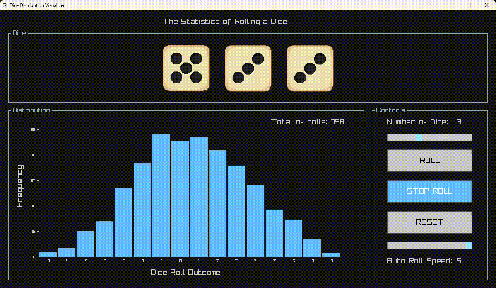

# Dice Distribution Visualizer

This program visualizes the distribution of rolling multiple dice.



## Overview

The distribution visualizes or proves the **Central Limit Theorem**, which states that if you roll multiple dice long enough and measure the frequency of their sums, the distribution of those totals will take on a bell curve shape. 
>This is obvisly not how a statistician would state the theorem, otherwise they'll lose their job, but you get the idea.

To model this curve and calculate the expected odds of any given sum, the following function is used:
```c
double get_probility(int dice_count, int sum)
{
	double mean = 3.5*dice_count;
	double st_deviation = sqrt(dice_count * 35.0/12.0);
	double exponent = -0.5 * pow((sum - mean) / st_deviation, 2.0);
	return (1.0 / (st_deviation * sqrt(2.0 * M_PI))) * exp(exponent);
}
```
This function calculates the approximate probability of getting a specific `sum` from a specific number of dice, `dice_count`.
Because actual dice rolls are discrete (you can roll a 17, but unless you walk on water you can not roll a 17.5) and this formula draws a smooth, continuous curve, the function gives a close approximation of the probability rather than the exact fractional odds.

It is basically an evaluation of the **Probability Density Function (PDF) of the Normal Distribution**. 

$$f(x) = \frac{1}{\sigma \sqrt{2\pi}} e^{-\frac{1}{2}\left(\frac{x - \mu}{\sigma}\right)^2}$$
## Prerequisites and Build
To complile this program you need the raylib library. 
```bash
# complile
make 
# run
./main
```
## Inspiration
This program was inspired by this  [blog post](https://giorgioluciano.github.io/posts/009_Dice_rolls/)

To get more insight about the Central Limit Theorem, you can check out these [notes](https://math.mit.edu/~dav/05.dir/class6-prep.pdf)
